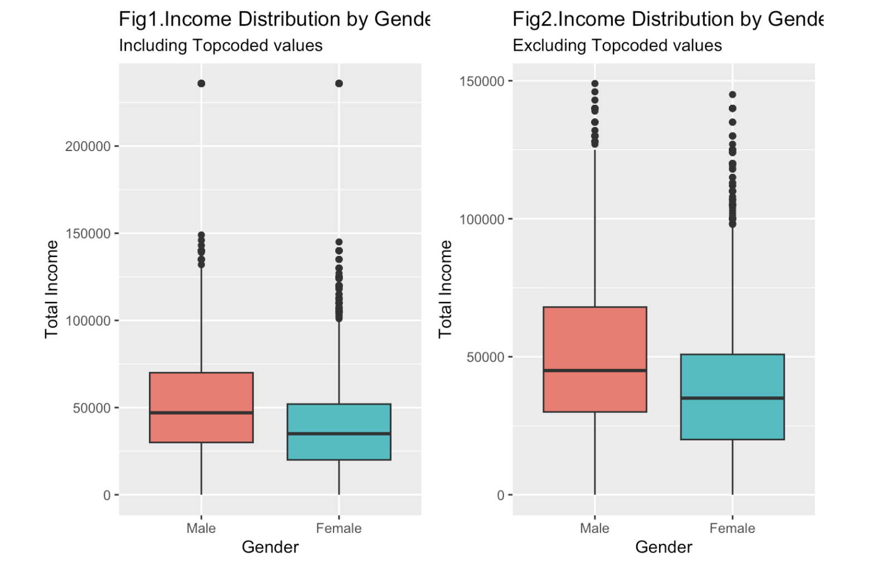
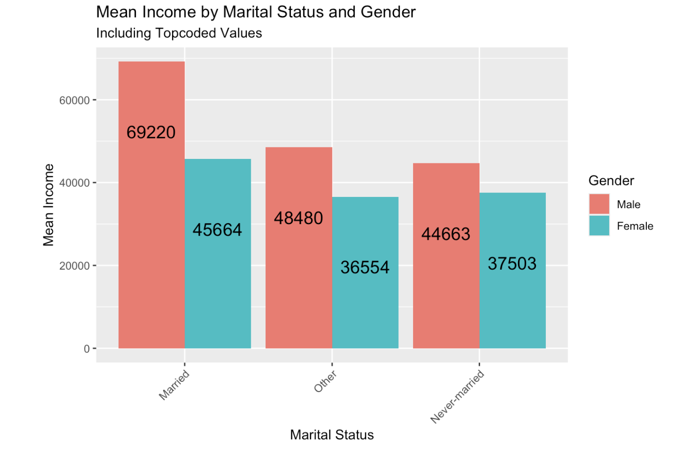

# 📊Exploratory Data Analysis on NLSY97 Dataset

**Authors**:  
- Abhishek Anand  
- Apurva Anand  
- Surajit Patra
---

## 📝 Project Description

This project involved a comprehensive exploratory data analysis (EDA) and regression modeling on the **NLSY97** dataset. The primary objective was to uncover socio-demographic patterns and investigate factors influencing income levels, with a specific focus on **gender-based income disparities** and how other variables interact with this relationship.

---

## 📁 Repository Structure

| File | Description |
|------|-------------|
| `analysisfile.Rmd` | Source RMarkdown containing full code and narrative |
| `Output.html` | Rendered report with embedded plots and interpretations |
| `Output.pdf` | Final project report for submission |

---

## 📦 Tools & Packages

- **R 4.x**, **RStudio**
- `tidyverse` – data wrangling, visualization
- `ggplot2` – plotting
- `knitr`, `gridExtra`, `moments` – report generation, grid layout, statistical moments
- `lm`, `t.test`, `Tobit regression` – statistical modeling

Install required packages using:

```r
install.packages(c("tidyverse", "ggplot2", "knitr", "gridExtra", "moments"))
```

---

## 📊 Dataset: NLSY97

- Total records: 8,984 respondents
- Columns: 95 variables initially, reduced to 15 key features for analysis
- Target variable: `total_income_2016`
- Topcoded: Top 2% of income values are topcoded to $235,884

---

## 🔍 Part 1: EDA on Selected Variables

Key variables analyzed:
- `gender`
- `birth_year`
- `race`
- `enrollment_status`
- `marital_status`
- `used_marijuana`
- `is_sad_depressed_unhappy_f`
- `total_income_2016`

For each, the following was performed:
- Cleaning (handling NAs, recoding factor levels)
- Summarization using counts and proportions
- Visualization using bar plots, histograms, and boxplots

---

## 📈 Part 2: Relationship & Trend Analysis

Analyzed the relationship between `total_income_2016` and:
- Gender
- Race
- Age (as of 1996)
- Citizenship
- Marital status
- Marijuana usage
- Trustfulness
- Education (highest grade completed)
- Industry code

### Key Insight:
> A consistent income gap was observed between genders across multiple categories.

---

## 📐 Part 3: Statistical Analysis & Modeling

### A. Normality Check
- Income distribution is right-skewed (heavily influenced by topcoded values).

### B. Confidence Intervals & Hypothesis Testing
Performed for both:
- With topcoded income values
- Without topcoded values

### C. Regression Models
- **Linear Regression (Multiple versions)**:
  - Income ~ Gender + Race + Marital Status + Citizenship + Marijuana Use + Industry
  - Sub-models to isolate impact of specific variables

- **Tobit Regression**:
  - Appropriate for censored data (topcoded incomes)

> Regression results reaffirm that gender, race, and education significantly affect income levels.

---
## 📊 Key Visualizations

### 🎯 Gender Distribution


---

---
### 💰 Income Distribution by Gender (Including Topcoded)


---

### 💰 Income Distribution by Marital Status and Gender (Including Topcoded)


---

### 📦 LINEAR REGRESSION MODEL FOR NO-TOPCODED (AGE 1996 + CITIZENSHIP)


---

## 🎯 Part 4: Storytelling & Methodology

### Highlights:
- **Handling missing values**: Replaced survey flags (-1 to -5) with `NA`
- **Topcoded income**: Analyzed with and without it to avoid skew
- **Variables that didn’t yield trends**: Some race/industry combinations
- **Final Model Focus**: Gender-income gap explained by education, criminal history, and depression-related responses

### 🧠 Methodology

Our central theme was to analyze **gender-related income disparities**. After a thorough exploration of the NLSY97 codebook, we selected relevant variables, renamed them for clarity, and transformed them where needed to enable meaningful visualization and statistical analysis.

To ensure robust insights, we segmented the population by gender and investigated how variables like race, education, drug use, trustfulness, and more affect income distribution. We used diverse visual tools such as bar charts, histograms, jitter plots, boxplots, and heatmaps to uncover patterns and support hypotheses.

---

### 🧹 Handling Missing Values

The dataset used coded negative values to represent missing or skipped responses:
- `-1`: Refused
- `-2`: Don’t Know
- `-3`: Invalid Skip
- `-4`: Valid Skip
- `-5`: Non-Interview

These were systematically recoded to `NA` for accurate statistical analysis. This cleanup was essential to ensure our regression models performed correctly and were not distorted by incomplete records.

---

### 💡 Handling Topcoded Income

The `total_income_2016` variable was **topcoded** for the top 2% of earners at $235,884. This inflated mean and max values, leading to a misleading view of the income distribution. We:
- Identified and excluded topcoded records (121 entries)
- Recalculated mean income: dropped from $49,447 to $44,939
- Updated plots: histograms and boxplots showed a less skewed and more interpretable distribution

This adjustment helped us avoid skewness and reveal a more **realistic picture of income inequality**.

---

### ❌ Trends That Didn’t Work Out

- We expected a clearer pattern between **income and marital status**, but income distributions overlapped across categories, especially for females.
- In examining marijuana use, female respondents who refused to answer appeared to have higher income than males, which was an unexpected anomaly.

---

### 🔍 Final Analysis Focus

We explored **15 different variables** in relation to `income` and `gender`, such as:
- Race
- Age
- Marital Status
- Trustfulness
- Education level
- Drug use
- Industry
- Citizenship
- Incarceration history

We ran multiple regression models:
- Income ~ Gender
- Income ~ Gender + Race + Marijuana Use + Industry
- Income ~ Gender + Age + Citizenship
- Income ~ Gender + Marital Status

Across all these models, **male respondents consistently earned more than female respondents**, highlighting a clear gender income gap in the dataset.
---

## 🧠 Part 5: Conclusion & Reflection

### Key Conclusions:
- Gender income disparity is statistically significant
- Educational attainment and criminal history are strong predictors of income
- Emotional wellness and trust levels have moderate correlations

### Limitations:
- 43% of `income_2016` data was missing or topcoded
- Some survey variables are coarse or ambiguously coded
- Survey self-reporting may introduce bias

> **Confidence**: Moderate to high, given consistent regression outputs and trends. Findings are suitable for presenting to stakeholders with proper disclaimers.

---

## ▶️ How to Run This Project

1. Open `analysisfile.Rmd` in RStudio
2. Run or Knit to generate `Output.html`
3. Data file (`nlsy97.csv`) must be available in the working directory
4. Ensure all libraries are installed (see packages list above)

---
